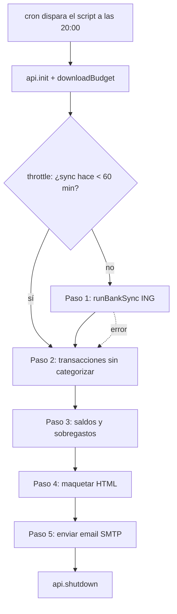

# Documento As-Is — actual-notifier

> Estado actual del proyecto a fecha **2026-09-19**. Sirve como punto de partida para optimizar y evolucionar la solución. Describe qué hay, cómo funciona, y qué problemas/riesgos existen hoy.
>
> **Nota de revisión (2026-09-19):** desde la versión anterior del documento se han corregido las roturas de construcción/arranque (crontab, entrypoint, nombre del fichero en `package.json`), se ha externalizado la configuración SMTP, se han añadido `.gitignore`, `.dockerignore` y `.env.example`, y se ha incorporado un *throttle* de sincronización bancaria. El proyecto ahora **es desplegable**.

---

## 1. Propósito del proyecto

Proveer un script en **JavaScript (Node.js)**, empaquetado en un contenedor **Docker**, que se ejecuta de forma programada (cron) para:

1. Conectarse a una instancia self-hosted de **Actual Budget** vía su API oficial (`@actual-app/api`).
2. Lanzar la **sincronización bancaria** (PSD2 / ING) del presupuesto.
3. Analizar el estado del presupuesto del mes en curso.
4. Enviar por **email (SMTP)** un **reporte diario** en HTML con el estado de gasto operativo del hogar.

---

## 2. Estructura actual del repositorio

```
actual-notifier/
├── .dockerignore           # Excluye secretos, node_modules y docs de la imagen
├── .env                    # Credenciales REALES (⚠️ ver riesgos) — ignorado por git
├── .env.example            # Plantilla de configuración sin secretos
├── .env.local              # Variante local de entorno (ignorada por git)
├── .gitignore              # Ignora .env*, node_modules, logs y caché
├── as-is.md                # Este documento
├── crontab.txt             # Definición de cron (20:00 diario)
├── docker-compose.yml
├── Dockerfile
├── entrypoint.sh           # Vuelca entorno, instala crontab y arranca cron
├── package.json
└── src/
    └── reporte-diario.js   # Toda la lógica (script monolítico)
```

> Todos los ficheros que antes estaban **referenciados pero ausentes** (`crontab.txt` y el nombre del script en `package.json`) ya existen y están alineados. Ver sección 5.

---

## 3. Componentes y funcionamiento

### 3.1. `src/reporte-diario.js`

Script único que ejecuta la función `ejecutarReporteDiario()` en 5 pasos secuenciales:

| Paso | Descripción |
|---|---|
| **Init** | `dotenv` carga variables de entorno con `override: true` (un `.env` montado como volumen tiene prioridad y se recarga en cada ejecución). Crea caché en `/tmp/actual-cache`. `api.init()` + `api.downloadBudget()`. |
| **Paso 1** | Sincronización bancaria (`api.runBankSync()`). Incluye un **throttle**: solo sincroniza si han pasado más de 60 min desde la última vez (marcador `/tmp/actual-cache/last-bank-sync.txt`); si no, la omite. Silencia temporalmente `process.stdout.write` para suprimir el volcado de transacciones de la API. Captura errores sin abortar. |
| **Paso 2** | Detecta transacciones **sin categorizar** del mes en curso en cuentas *on-budget* (excluye padres desglosados y transferencias internas). |
| **Paso 3** | Calcula **disponibilidad presupuestaria**: saldo y "ritmo diario" de 5 categorías objetivo, más un barrido de categorías con **saldo negativo** (sobregasto). |
| **Paso 4** | Maqueta el **HTML** del correo (badges de estado, tablas, bloques condicionales). |
| **Paso 5** | Envía el email por **SMTP** (`nodemailer`) a múltiples destinatarios. Compone un asunto dinámico con etiquetas de alerta. |

**Categorías monitorizadas (hardcoded):**
`Gasto Personal`, `Farmacia y Botiquin`, `Supermercado y Alimentación`, `Ocio y Restaurantes`, `Transporte`.

**Configuración SMTP (externalizada):**
Host, puerto y modo seguro se leen de variables de entorno (`SMTP_HOST`, `SMTP_PORT`, `SMTP_SECURE`), con valores por defecto de `port: 465` y `secure` deducido del puerto. Usuario y contraseña (`SMTP_USER`, `SMTP_PASS`) también provienen del entorno.

### 3.2. `package.json`

- `name`: `actual-notifier`, `version`: `1.0.0`.
- `main` y `scripts.start` → **`src/reporte-diario.js`** (nombre correcto, alineado con el fichero real).
- Dependencias: `@actual-app/api ^26.8.1`, `dotenv ^16.4.5`, `nodemailer ^6.9.13`.
- No hay `devDependencies`, ni linter, ni tests.

### 3.3. `Dockerfile`

- Base: `node:20-slim`.
- Instala `cron`, `tzdata`, y herramientas de compilación (`python3`, `make`, `g++`) necesarias para compilar `better-sqlite3` (dependencia nativa de la API de Actual).
- `TZ=Europe/Madrid`.
- `npm install --omit=dev`.
- Copia `src/`, `crontab.txt` y `entrypoint.sh`; da permisos de ejecución al entrypoint.
- `CMD`: ejecuta `/usr/local/bin/entrypoint.sh`.

### 3.4. `entrypoint.sh`

- Vuelca el entorno del contenedor a `/etc/environment` para que los jobs de cron dispongan de `TZ`, `PATH`, etc.
- Instala la planificación desde `/app/crontab.txt` con `crontab` (editable sin reconstruir la imagen).
- Arranca `cron -f` en foreground.

### 3.5. `crontab.txt`

- Una única entrada: ejecuta el reporte **todos los días a las 20:00** cargando `/etc/environment`, `cd /app` y ejecutando `node src/reporte-diario.js`, redirigiendo la salida a `/var/log/cron.log`.

### 3.6. `docker-compose.yml`

- Servicio `actual-notifier` (`container_name: actual_notifier`), build local, `restart: unless-stopped`.
- Monta como volúmenes de solo lectura: `./src`, `./crontab.txt` y `./.env`, permitiendo cambiar código, planificación y credenciales sin reconstruir la imagen.
- Red externa `actual_net` (compartida con el contenedor de Actual Budget).

### 3.7. Variables de entorno (`.env`)

Existe una plantilla `.env.example` con todas las claves y valores de ejemplo.

| Variable | Uso |
|---|---|
| `ACTUAL_SERVER_URL` | URL del servidor Actual Budget |
| `ACTUAL_PASSWORD` | Contraseña del servidor Actual |
| `ACTUAL_SYNC_ID` | ID del presupuesto a descargar |
| `SMTP_HOST` | Host del servidor SMTP |
| `SMTP_PORT` | Puerto SMTP (por defecto `465`) |
| `SMTP_SECURE` | `true`/`false` para TLS implícito (por defecto, deducido del puerto) |
| `SMTP_USER` | Usuario SMTP (también usado como remitente `from`) |
| `SMTP_PASS` | Contraseña SMTP |
| `NOTIFICATION_EMAIL` | Lista de destinatarios separados por comas |

---

## 4. Flujo de ejecución (alto nivel)



---

## 5. Problemas detectados (bugs y roturas)

| # | Severidad | Problema | Estado |
|---|---|---|---|
| 1 | ✅ Resuelto | `crontab.txt` no existía pero el `Dockerfile` hacía `COPY crontab.txt`. | Ya existe; la imagen se construye. |
| 2 | ✅ Resuelto | `package.json` apuntaba a `src/reporte_diario.js` (guion bajo). | Alineado a `src/reporte-diario.js`; `npm start` funciona. |
| 3 | ✅ Resuelto | El contenedor arrancaba `cron` sin definición de planificación efectiva. | `entrypoint.sh` instala `crontab.txt` (20:00 diario) en el arranque. |
| 4 | ✅ Resuelto | Config SMTP (host/puerto) hardcoded en el código. | Externalizada vía `SMTP_HOST`/`SMTP_PORT`/`SMTP_SECURE`. |
| 5 | 🟠 Media | No hay **healthcheck** ni logging persistente estructurado. Cron escribe a `/var/log/cron.log` dentro del contenedor, sin rotación ni evidencia externa de éxito/fallo del envío. | Difícil de operar y depurar. |
| 6 | 🟡 Baja | Lista de categorías y textos **hardcoded** en el script. | Requiere editar código para adaptarlo. |

---

## 6. Riesgos de seguridad

| # | Severidad | Riesgo | Recomendación |
|---|---|---|---|
| S1 | 🔴 Crítica | **`.env` contiene credenciales reales** (contraseña de Actual, contraseña SMTP) presentes en el árbol del proyecto. Ya está en `.gitignore`, pero si estuvo versionado alguna vez sigue comprometido. | Rotar **todas** las credenciales expuestas. Verificar que `.env` nunca se subió al historial de git. |
| S2 | ✅ Resuelto | No existía `.gitignore` ni `.dockerignore`. | Ambos existen: ignoran `.env*`, `node_modules`, logs y caché. |
| S3 | 🟡 Baja | El `Dockerfile`/`entrypoint.sh` ejecutan como `root` y vuelcan todo `printenv` a `/etc/environment`. | Usar usuario no privilegiado; limitar variables expuestas. |

> ⚠️ **Acción prioritaria:** al haber credenciales reales presentes en `.env`, deben considerarse comprometidas y **rotarse**.

---

## 7. Deuda técnica y oportunidades de mejora

**Arquitectura / código**
- Script **monolítico** (~300 líneas): mezcla conexión, lógica de negocio, presentación HTML y envío. Separar en módulos (cliente Actual, cálculo, render de plantilla, mailer).
- Categorías objetivo y plantilla HTML aún hardcoded (SMTP ya externalizado).
- Sin **tests** ni linter/formatter (ESLint/Prettier).
- Uso de `process.stdout.write` override como *hack* para silenciar la API; frágil.

**Operación / DevOps**
- ✅ Construcción de la imagen corregida (crontab, entrypoint, nombre de fichero, `.dockerignore`).
- ✅ Estrategia de cron definida vía `crontab.txt` + `entrypoint.sh`.
- Añadir **healthcheck**, logs estructurados y notificación de fallos del propio proceso (rotación de `/var/log/cron.log`).
- Fijar versiones y considerar *multi-stage build* para reducir tamaño de imagen (separar toolchain de compilación del runtime) y ejecutar como usuario no root.

**Funcionalidad**
- Parametrizar categorías objetivo vía entorno/config.
- Manejo de errores más robusto en `init`/`downloadBudget` (hoy un fallo temprano aborta sin email de aviso).
- Internacionalización / plantilla HTML externa.

---

## 8. Resumen ejecutivo

El proyecto **cumple su objetivo** (reporte diario de Actual Budget por email) y la **lógica de negocio en `reporte-diario.js` está bien estructurada y es funcional**. A diferencia de la revisión anterior, **ya es desplegable**: la imagen Docker se construye (existe `crontab.txt`), `npm start` apunta al fichero correcto, y la planificación de cron es efectiva gracias a `entrypoint.sh`. Además, la configuración SMTP está externalizada y existen `.gitignore`, `.dockerignore` y `.env.example`. Persiste un **riesgo de seguridad** por las credenciales reales presentes en `.env`.

**Prioridades siguientes para evolucionar:**
1. Rotar credenciales y confirmar que `.env` nunca llegó al historial de git.
2. Añadir observabilidad: healthcheck, logs estructurados y aviso de fallos del proceso.
3. Ejecutar el contenedor como usuario no root (multi-stage build).
4. Refactorizar el script monolítico hacia módulos y externalizar categorías/plantilla.
