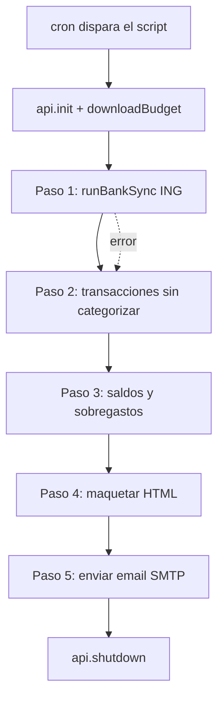

# Documento As-Is — actual-notifier

> Estado actual del proyecto a fecha **2026-09-14**. Sirve como punto de partida para optimizar y evolucionar la solución. Describe qué hay, cómo funciona, y qué problemas/riesgos existen hoy.

---

## 1. Propósito del proyecto

Proveer un script en **JavaScript (Node.js)**, empaquetado en un contenedor **Docker**, que se ejecuta de forma programada (cron) para:

1. Conectarse a una instancia self-hosted de **Actual Budget** vía su API oficial (`@actual-app/api`).
2. Lanzar la **sincronización bancaria** (PSD2 / ING) del presupuesto.
3. Analizar el estado del presupuesto del mes en curso.
4. Enviar por **email (SMTP)** un **reporte diario** en HTML con el estado de gasto operativo del hogar.

---

## 2. Estructura actual del repositorio

```
actual-notifier/
├── .env                    # Credenciales REALES (⚠️ ver riesgos)
├── docker-compose.yml
├── Dockerfile
├── package.json
└── src/
    └── reporte-diario.js   # Toda la lógica (script monolítico)
```

Ficheros **referenciados pero ausentes** en el repositorio:

| Referencia | Ubicación que lo espera | Estado |
|---|---|---|
| `crontab.txt` | `Dockerfile` (`COPY crontab.txt ...`) | ❌ No existe |
| `src/reporte_diario.js` | `package.json` (`main` y `start`) | ❌ No existe (el fichero real usa guion: `reporte-diario.js`) |

---

## 3. Componentes y funcionamiento

### 3.1. `src/reporte-diario.js`

Script único que ejecuta la función `ejecutarReporteDiario()` en 5 pasos secuenciales:

| Paso | Descripción |
|---|---|
| **Init** | `dotenv` carga variables de entorno. Crea caché en `/tmp/actual-cache`. `api.init()` + `api.downloadBudget()`. |
| **Paso 1** | Sincronización bancaria (`api.runBankSync()`). Silencia temporalmente `process.stdout.write` para suprimir el volcado de transacciones de la API. Captura errores sin abortar. |
| **Paso 2** | Detecta transacciones **sin categorizar** del mes en curso en cuentas *on-budget* (excluye padres desglosados y transferencias internas). |
| **Paso 3** | Calcula **disponibilidad presupuestaria**: saldo y "ritmo diario" de 5 categorías objetivo, más un barrido de categorías con **saldo negativo** (sobregasto). |
| **Paso 4** | Maqueta el **HTML** del correo (badges de estado, tablas, bloques condicionales). |
| **Paso 5** | Envía el email por **SMTP** (`nodemailer`) a múltiples destinatarios. Compone un asunto dinámico con etiquetas de alerta. |

**Categorías monitorizadas (hardcoded):**
`Gasto Personal`, `Farmacia y Botiquin`, `Supermercado y Alimentación`, `Ocio y Restaurantes`, `Transporte`.

**Configuración SMTP (hardcoded):**
`host: smtp.purelymail.com`, `port: 465`, `secure: true`. Solo usuario/contraseña provienen de variables de entorno.

### 3.2. `package.json`

- `name`: `actual-notifier`, `version`: `1.0.0`.
- `main` y `scripts.start` → **`src/reporte_diario.js`** (nombre incorrecto, con guion bajo).
- Dependencias: `@actual-app/api ^26.8.1`, `dotenv ^16.4.5`, `nodemailer ^6.9.13`.
- No hay `devDependencies`, ni linter, ni tests.

### 3.3. `Dockerfile`

- Base: `node:20-slim`.
- Instala `cron`, `tzdata`, y herramientas de compilación (`python3`, `make`, `g++`) necesarias para compilar `better-sqlite3` (dependencia nativa de la API de Actual).
- `TZ=Europe/Madrid`.
- `npm install --omit=dev`.
- Copia `src/` y `crontab.txt` a `/etc/cron.d/actual-cron`.
- `CMD`: vuelca el entorno a `/etc/environment` y arranca `cron -f` en foreground.

### 3.4. `docker-compose.yml`

- Servicio `actual-notifier`, build local, `restart: unless-stopped`.
- Variables desde `.env` (`env_file`).
- Monta `./src:/app/src:ro` (código en solo lectura).
- Red externa `actual_net` (compartida con el contenedor de Actual Budget).

### 3.5. Variables de entorno (`.env`)

| Variable | Uso |
|---|---|
| `ACTUAL_SERVER_URL` | URL del servidor Actual Budget |
| `ACTUAL_PASSWORD` | Contraseña del servidor Actual |
| `ACTUAL_SYNC_ID` | ID del presupuesto a descargar |
| `SMTP_USER` | Usuario SMTP (también usado como remitente `from`) |
| `SMTP_PASS` | Contraseña SMTP |
| `NOTIFICATION_EMAIL` | Lista de destinatarios separados por comas |

---

## 4. Flujo de ejecución (alto nivel)



---

## 5. Problemas detectados (bugs y roturas)

| # | Severidad | Problema | Impacto |
|---|---|---|---|
| 1 | 🔴 Alta | **`crontab.txt` no existe** pero el `Dockerfile` hace `COPY crontab.txt`. | La imagen **no se construye** (`docker build` falla). |
| 2 | 🔴 Alta | `package.json` apunta a `src/reporte_diario.js` (guion bajo); el fichero real es `reporte-diario.js` (guion). | `npm start` **falla** por módulo no encontrado. |
| 3 | 🟠 Media | El contenedor arranca `cron` pero **no hay definición de cron** disponible, por lo que el reporte **nunca se ejecuta** (incluso si la imagen se construyera). | Sin programación efectiva. |
| 4 | 🟠 Media | No hay **healthcheck** ni logging persistente. La salida de cron va a `stdout` del contenedor sin rotación ni evidencia de éxito/fallo del envío. | Difícil de operar y depurar. |
| 5 | 🟡 Baja | Config SMTP (host/puerto) **hardcoded** en el código. | Poco flexible / acoplado al proveedor. |
| 6 | 🟡 Baja | Lista de categorías y textos **hardcoded** en el script. | Requiere editar código para adaptarlo. |

---

## 6. Riesgos de seguridad

| # | Severidad | Riesgo | Recomendación |
|---|---|---|---|
| S1 | 🔴 Crítica | **`.env` contiene credenciales reales** (contraseña de Actual, contraseña SMTP) y está en el árbol del proyecto. | Rotar **todas** las credenciales expuestas de inmediato. Añadir `.env` a `.gitignore`. Nunca versionarlo. |
| S2 | 🟠 Media | No existe `.gitignore` ni `.dockerignore`, por lo que `.env` y `node_modules` podrían incluirse en imagen/repositorio. | Crear ambos ficheros. |
| S3 | 🟡 Baja | El `Dockerfile` ejecuta como `root` y vuelca todo `printenv` a `/etc/environment`. | Usar usuario no privilegiado; limitar variables expuestas. |

> ⚠️ **Acción prioritaria:** al haber credenciales reales presentes en `.env`, deben considerarse comprometidas y **rotarse**.

---

## 7. Deuda técnica y oportunidades de mejora

**Arquitectura / código**
- Script **monolítico** (~300 líneas): mezcla conexión, lógica de negocio, presentación HTML y envío. Separar en módulos (cliente Actual, cálculo, render de plantilla, mailer).
- Sin manejo de configuración externalizada (categorías, SMTP, plantilla).
- Sin **tests** ni linter/formatter (ESLint/Prettier).
- Uso de `process.stdout.write` override como *hack* para silenciar la API; frágil.

**Operación / DevOps**
- Corregir la construcción de la imagen (crontab, nombre de fichero, `.dockerignore`).
- Estrategia de **cron**: definir el `crontab.txt` o migrar a un orquestador (por ejemplo, ejecutar el contenedor como *job* one-shot lanzado por el cron del host, o usar un scheduler).
- Añadir **healthcheck**, logs estructurados y notificación de fallos del propio proceso.
- Fijar versiones y considerar *multi-stage build* para reducir tamaño de imagen (separar toolchain de compilación del runtime).

**Funcionalidad**
- Parametrizar categorías objetivo y proveedor SMTP vía entorno/config.
- Manejo de errores más robusto en `init`/`downloadBudget` (hoy un fallo temprano aborta sin email de aviso).
- Internacionalización / plantilla HTML externa.

---

## 8. Resumen ejecutivo

El proyecto **cumple su objetivo conceptual** (reporte diario de Actual Budget por email) y la **lógica de negocio en `reporte-diario.js` está bien estructurada y es funcional**. Sin embargo, en su estado actual **no es desplegable tal cual**: la imagen Docker no se construye (falta `crontab.txt`), el `npm start` apunta a un nombre de fichero inexistente, y no hay una definición de cron efectiva. Además, existe un **riesgo de seguridad crítico** por credenciales reales presentes en `.env`.

**Prioridades inmediatas para evolucionar:**
1. Rotar credenciales y añadir `.gitignore` / `.dockerignore`.
2. Crear `crontab.txt` y alinear el nombre del fichero en `package.json`.
3. Verificar build y ejecución end-to-end.
4. Refactorizar hacia módulos y añadir observabilidad (logs/healthcheck).
